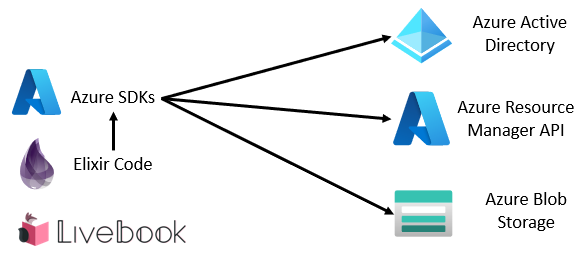

# `chgeuer/elixir-livebook-azure-demo`

A small demo to show how to access Azure from Elixir:




Launch livebook

```bash
curl https://raw.githubusercontent.com/chgeuer/elixir-livebook-azure-demo/main/run.sh | bash
```

```
https://raw.githubusercontent.com/chgeuer/elixir-livebook-azure-demo/main/azure.livemd
```
